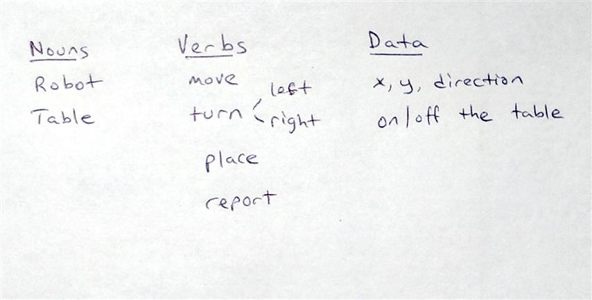
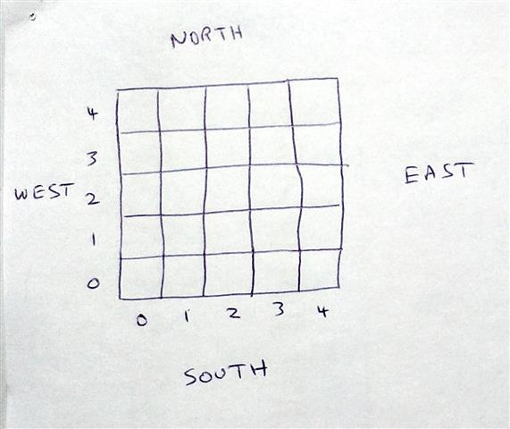
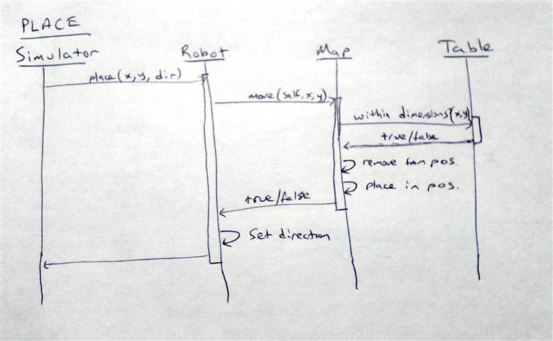
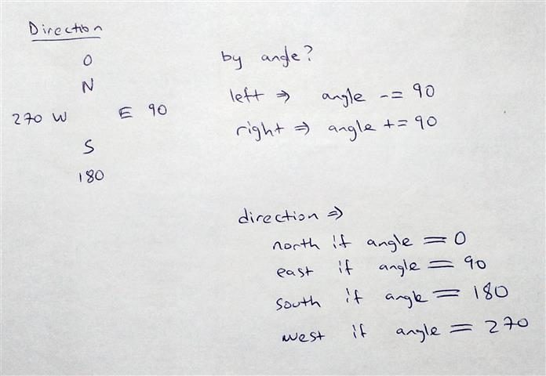
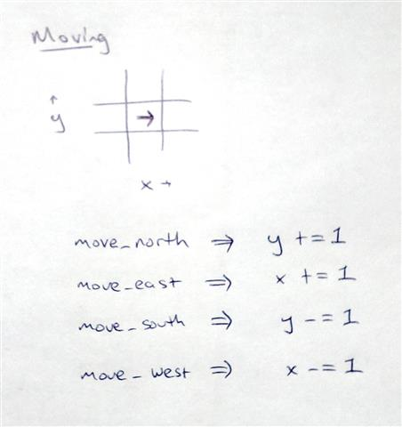

# Toy Robot Simulator

This application simulates a toy robot moving around a square tabletop. Input is provided through a file and output printed to the console.

This project has been written to specifications defined in [REQUIREMENTS.md](REQUIREMENTS.md) which defines the problem space, use cases, input and output format and the deliverables. Please read it first to be familiar with the requirements and understand the scope of the work being done here.


## Installation

The code in this project is written in the Ruby programming language. It is provided in source format, without a compiled executable, so you will need to have a Ruby interpreter available in order to run the code.

Ruby can be installed on most platforms. You can check if you have a ruby interpreter installed, and what version it is by typing the following command in a console window (ignore the $ at the beginning, it indicates a command prompt - yours might be different):

```
$ ruby -v
```

If you need to install Ruby see below for instructions.

This code has been tested using Ruby version 2.2.2 running on Ubuntu 14.04.

### Instructions

1. Install Ruby
  - See [instructions](https://www.ruby-lang.org/en/documentation/installation/) on ruby-lang.org
2. Install Bundler
  - See [instructions](http://bundler.io/) on bundler.io
  - It may be as simple as typing `gem install bundler`
3. Clone this repository on your development machine:
  - Cloning means making a copy of a remote repository on your local machine so you can work with it. You don't make any changes to the original repository by cloning, unless you edit some files, _commit_ your changes, and _push_ those changes.
  - Cd to the directory you want to place the files under. To place them in a folder under your home directory: `cd ~`
  - Type `git clone git@github.com:lessan/toyrobot.git`
  - See [instructions](https://help.github.com/articles/cloning-a-repository/) on github.com for more details about cloning a repository.
4. Install required gems:
  - Cd to the toyrobot directory: `cd ~/toyrobot`
  - Type `bundle install`
  - This will download and install all the gems required for this project.


## Usage

### Input

The simulator reads input from a [file](data/commands.txt) called `commands.txt` in the `data` directory. If you would like to change the sequence of commands, edit that file. Extra whitespace before or after the commands will be ignored. A sample of the contents of this file would be:

```
PLACE 0,0,NORTH
LEFT
REPORT
```

### Command Reference

Commands and arguments are not case sensitive - any combination of upper and lower case characters will work. For example, the following are equivalent:
```
MOVE
move
Move
mOvE
```

Each command must be separated from the next by a newline character. This can be either `\n`, `\r`, or `\r\n`. Simply pressing ENTER between commands in any editor or browser window will add an acceptable newline.

The table is divided into a square grid of 5 sections on each side:

**4** |       |       |       |       |       |
------|-------|-------|-------|-------|-------|
**3** |       |       |       |       |       |
**2** |       |       |       |       |       |
**1** |       |       |       |       |       |
**0** |       |       |       |       |       |
      | **0** | **1** | **2** | **3** | **4** |

If a command results in the Robot being placed outside the table or moving off the table then it will be silently ignored.

Valid commands are:

Command | Arguments | Description
------- | --------- | -----------
PLACE   | X, Y, DIR | Place the Robot on the table at the initial position indicated by X and Y, and facing in the direction DIR. Valid positions are 0 to 5 for both X and Y. Valid directions are NORTH, SOUTH, EAST and WEST. Arguments must be separated from the PLACE command by one or more spaces, and separated from each other by a comma (spaces around them will be ignored).
MOVE    |           | Move the Robot one cell forward in the direction it is facing.
LEFT    |           | Turn the Robot 90 degrees counter-clockwise. For example if it was facing NORTH it would now be facing WEST.
RIGHT   |           | Turn the Robot 90 degrees clockwise. For example if it was facing NORTH it would now be facing EAST.
REPORT  |           | A message describing the current status of the Robot (its position and direction) will be printed to standard output (i.e. the console window). For example: `Output: 1, 1, NORTH`.

Invalid commands will be silently ignored.

Any commands before the first PLACE command will be silently ignored.

The PLACE command can be issued more than once; on subsequent times it will re-position the Robot. All other commands can also be issued multiple times.

### Running the Simulator

To run the simulator, invoke the default rake task:

```
$ cd ~/toyrobot
$ bundle exec rake
```

This will load the input file, process the commands and print the result of any REPORT commands out to the console. You should see the following output (depending on the contents of your command.txt file):

```
Robot Simulator
---------------
Input is being read line by line from data/commands.txt:

PLACE 0,0,NORTH
MOVE
REPORT
Output: 0,1,NORTH

Simulation ended.
```


## Testing

Most of the code is covered by Unit and Integration tests which are located in the `spec` directory and are written using [RSpec](http://rspec.info/).

Read through these tests to understand how the code works.
The convention is to first cover the happy path: the intended functionality of the code under normal circumstances, and then to address the various sad paths: edge and error cases.
It is impossible or impractical to cover every possible scenario, but the most likely and those with the most impact are covered.
Certain sections of the code are covered in more detail than others due to their complexity and the risk involved in something going wrong there.
For example, the Rake task which loads the input from a file and invokes the simulator is not covered by any tests, whereas the Robot class is fully covered.

To run the entire test suite:

```
$ cd ~/toyrobot
$ bundle exec rspec
```

To run all the tests in one file:

```
$ cd ~/toyrobot
$ bundle exec rspec ./spec/robot_simulator_spec.rb
```

To run a single test case, specify the line number on which it occurs. For example, to run the test whose definition starts at line 10:

```
$ cd ~/toyrobot
$ bundle exec rspec ./spec/robot_simulator_spec.rb:10
```


## Design

In this section I discuss the design of this application and the decisions that were made along the way.
It should prove helpful for reviewing the code, for modifying it or extending it in future and may also prove helpful for others working on a similar application.

#### Steps to getting started
1. Read [REQUIREMENTS.md](REQUIREMENTS.md)
2. Make notes of central concepts: nouns, verbs and the data that is exchanged:<br />
   
3. Draw a table with a numbered 5x5 grid and compass directions:<br />
   
4. Sketch several sequence diagrams to better understand the messages that get passed between objects. These are throw-away and not intended to be official artifacts; their purpose is to help us better understand the messages that are passing between objects, in a more lightweight and flexible format than having to write and modify the code itself. You can read more about this in the book [Practical Object-Oriented Design in Ruby](http://www.sandimetz.com/products). Here's a sample sequence diagram for the PLACE command:<br />
   
5. Consider how I would implement key methods, to see if there would be any repercussions on the design:<br />
    
6. Create a skeleton project and upload it to a repository such as this one on github
7. Start implementing classes using an outside-in approach: Rakefile, then Simulator, then CommandParser, etc.

#### Steps for implementing each object
1. The implementation starts with me having a an idea of the responsibility for this object (what it does)
2. I then think about how I would implement this, possibly writing a spike in a throw-away test
3. Once I have an idea of how I would implement it and its public interface (methods and return values), I fill out the spec file with tests, starting with the happy path (when things go the way they should) and adding pending tests for sad paths as I think of them, later implementing the pending tests
4. Once I have a few tests, I start implementing the methods to pass the tests, then Red-Green-Refactor

#### What is in a skeleton project?
There are certain things you want to include whenever you start a new project, such as a .gitignore file, gems, a LICENSE and a README. Over time, you will develop certain preferences about which gem or license to use, for example, or you may have a style guide at work that you wish to adhere to.

In the case of this project, here's what I added:
- the [rake](https://github.com/ruby/rake) gem: I decided to use rake to run the simulator rather than invoke it directly from the command line
- the [rspec](https://github.com/rspec/rspec) gem: I prefer to use RSpec for testing due to its readable syntax (called a Domain Specific Language or DSL). There are other popular options such as [minitest](https://github.com/seattlerb/minitest) or [Test::Unit](http://ruby-doc.org/stdlib-1.8.7/libdoc/test/unit/rdoc/Test/Unit.html)
- the [rubocop](https://github.com/bbatsov/rubocop) gem: a popular code analyzer which helps enforce many of the guidelines from the community driven [Ruby Style Guide](https://github.com/bbatsov/ruby-style-guide). Even though seasoned developers would automatically adopt these styles, I find it useful to include this gem so anyone working on the project can check their code before committing it (type `rubocop` to run it)
- the [simplecov](https://github.com/colszowka/simplecov) gem: provides code coverage. We should all be writing code which is covered well by tests. This just provides that extra check that we didn't miss something obvious. Once started (see below) it shows a summary message when your code has finished running and also writes a full report to the `/coverage` folder

To go with those gems, I exclude the `coverage` folder in [.gitignore](.gitignore) and start simplecov in [spec/spec_helper.rb](spec/spec_helper.rb):
```
require 'simplecov'
SimpleCov.start
```

That should be enough to get started writing specs and implementing them.

#### Implementing the [Rakefile](Rakefile)
I decided to include the functionality for reading a file here instead of in the Simulator class because the requirements make it clear that this aspect is not an important concern: you can opt to use STDIN instead. So in case we later switch to using that, I wrote the Simulator so it accepts one line of command at a time.

#### Implementing the [CommandParser](lib/command_parser.rb)
After creating a skeleton Simulator class, I realized the first bit of functionality I need is to parse the commands. There are a number of approaches one could take for this:
1. Implement the commands as ruby code using a [Domain Specific Language (DSL)](http://martinfowler.com/books/dsl.html)
2. Parse the commands coming from the command line or from a file as a parameter, using a command-line parser (e.g. [optparse](http://ruby-doc.org/stdlib-2.2.4/libdoc/optparse/rdoc/OptionParser.html) which comes with ruby)
3. Build a custom parser

I didn't choose the first option because the current syntax is not complicated enough to warrant a DSL. If, for example, the code included conditional statements or loops, then it would definately benefit from being parsed as ruby syntax (using an Abstract Syntax Tree for example) and mapped to code using DSL techniques.
The second option is also not well suited for this as the focus of the project is not on interacting with the command line as a utility but rather in processing a non-trivial number of commands in sequence.

In implementing a custom parser, I also decided not to use a built-in function that could have been helpful ([Shellwords](http://ruby-doc.org/stdlib-2.2.4/libdoc/shellwords/rdoc/Shellwords.html)) for the split functionality, as it didn't quite match the syntax we are working with.

Here is an overview of the steps our CommandParser takes:
- split the command string into two sections separated by a space: Command and Arguments. This is simply `string.split(' ', 2)` where 2 limits the number of sections to be split by
- split up the Arguments by comma, then clean them up in case there are extra spaces:`string.split(',').map!(&:strip)` . See http://stackoverflow.com/a/20735560/59661 for a discussion on various methods of doing this
- check that the Command is valid (compare against a whitelist) so we don't get hacked with someone executing an arbitrary method by including it in commands.txt
- apply the Command to an object, in our case an instance of the Robot class

#### Implementing the [Navigator](lib/navigator.rb)
Another major decision was to put the methods dealing with moves outside the Robot class. I decided to do this because the functionality for placing, moving and turning have to do with the concept of navigation, rather than with a Robot. If we had a toy Car as well, for example, we could create a Car class which also uses the same Navigation system.

I then separated specific functionality into the [DirectionMatrix](lib/direction_matrix.rb) and [Compass](lib/compass.rb) objects because they were not part of the main responsibility of the Navigator.

#### Implementing the [Commands](lib/commands/)
Instead of having the simulator run the commands itself, or send a message to the Robot or the Navigator, I decided to create a separate class for each command which performs the steps required. This isolates the responsibility for each command within one class and will make it easier to add or change commands in future. The command objects, of course, don't know the specifics of how to turn or move, for example, as that is handled by the Navigator. But they sanitize the input and perform validation, then send a message to the Navigator to do what needs to be done.

#### Implementing the [Robot](lib/robot.rb) and the [Table](lib/table.rb)
When all is said and done, the Robot object simply contains what's specific to it: it's position and orientation. The Table object likewise has dimensions and can respond to a message asking if a given position is within those dimensions.


## License
This project is licensed under the MIT License. See the [LICENSE.md](LICENSE.md) file for your rights and limitations.


## Contributing
This project is a response to the exercise outlined in the [requirements](REQUIREMENTS.md). As you read through the code or work with the application you may find areas that need to be improved or bugs with the code. Please feel free to contribute by highlighting the issue or suggesting a fix. Here's how to do it:

#### Suggest a change: Create an issue
[Log an issue](https://github.com/lessan/toyrobot/issues) with the github issue tracker for this project. First check existing issues to ensure one doesn't already exist, then create a new issue. All you need is a title and a comment. For bugs, please include:
- the version of the code you were using (master at a certain date, or a particular branch)
- the steps you took which caused the problem to occur
- a dump of output from the console showing the issue
- a copy of your `data/commands.txt`, if relevant

For improvements to the code or documentation:
- the path to the file(s) concerned
- a description of the suggestion
- include links which provide further information about the issue, if possible

#### Make the change yourself
Since this is open source software, you are most welcome to make the changes yourself and request them to be integrated into the main codebase. You could also contribute changes to an [issue](https://github.com/lessan/toyrobot/issues) someone else reported. This is common practice among open source projects and you will find plenty of [documentation](https://guides.github.com/activities/contributing-to-open-source/) for how to do this online. Below is a summary, enough to make simple changes:

1. [Fork the project on GitHub](https://help.github.com/fork-a-repo/): A fork is a copy of a repository used to propose changes to the original repository or to use it as a starting point for your own idea. Simply click the "Fork" button on the top right of the github project page and provide the details for the new repository

2. [Clone your repository](https://help.github.com/articles/cloning-a-repository/): Create a copy of the repository on your local computer, which you can make changes to and synchronize with the remote repository: `git clone git@github.com:lessan/toyrobot.git`

3. Run tests to ensure the application is working on your machine: `bundle exec rspec`

4. Make changes to the code. Try to make changes related to one issue at a time

5. Run `rubocop` to see if your changes follow the [Ruby Style Guide](https://github.com/bbatsov/ruby-style-guide), and fix any warnings that are issued

6. Run the entire test suite again to ensure your changes didn't break anything: `bundle exec rspec`

7. Commit your changes to your local repository: type `git status` to see what files have been changed, `git diff` to see what was changed, then `git commit -m "A brief message"` with a message describing the changes

8. Synchronize your local repository with the remote one on github: `git push` to push your local commits to the remote repository

9. [Make a Pull Request](https://help.github.com/articles/using-pull-requests/): click the green "New pull request" button on your (forked) repository. This will bring up a page comparing your changes with those of the original repository. You can then add a title and comment

10. Discuss the Pull Request: a Pull Request (sometimes referred to by the acronym PR) is a great place to review changes with a team of collaborators. You can add general comments or comment on a specific line of code

11. As the maintainer of this repository, I will need to review the changes in the PR after which I may decide to merge it into the master branch of this repository

NOTE: by contributing changes to the code, you agree to license your contribution under the [MIT License](LICENSE.md)
